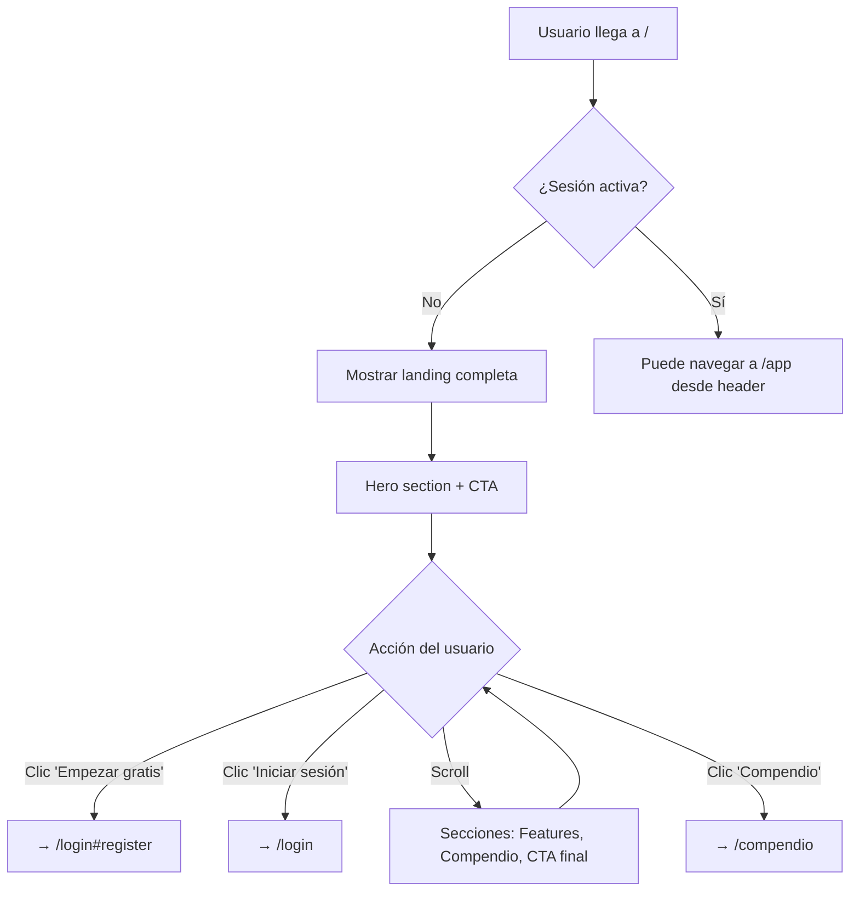
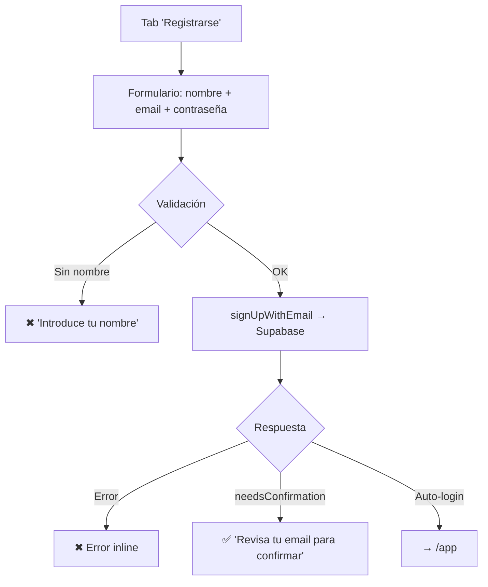
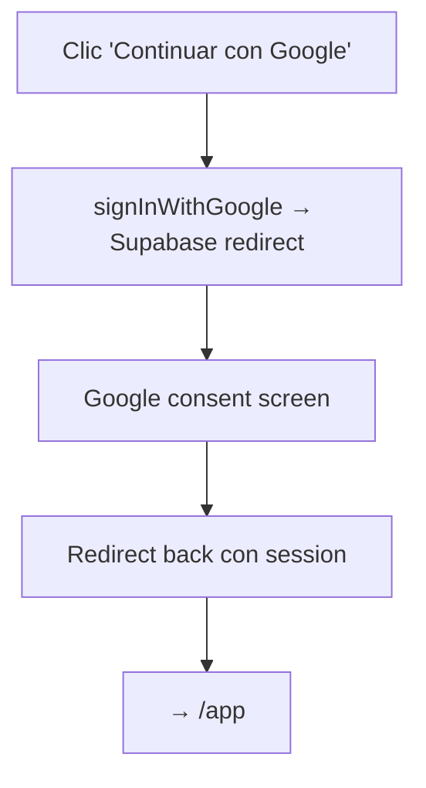
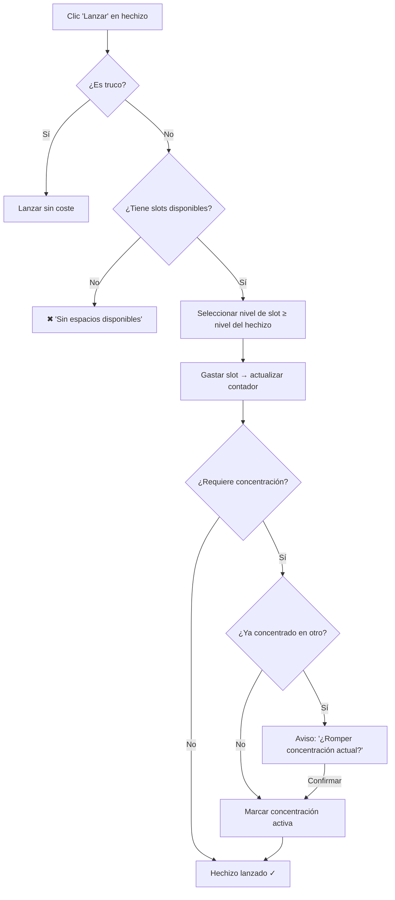
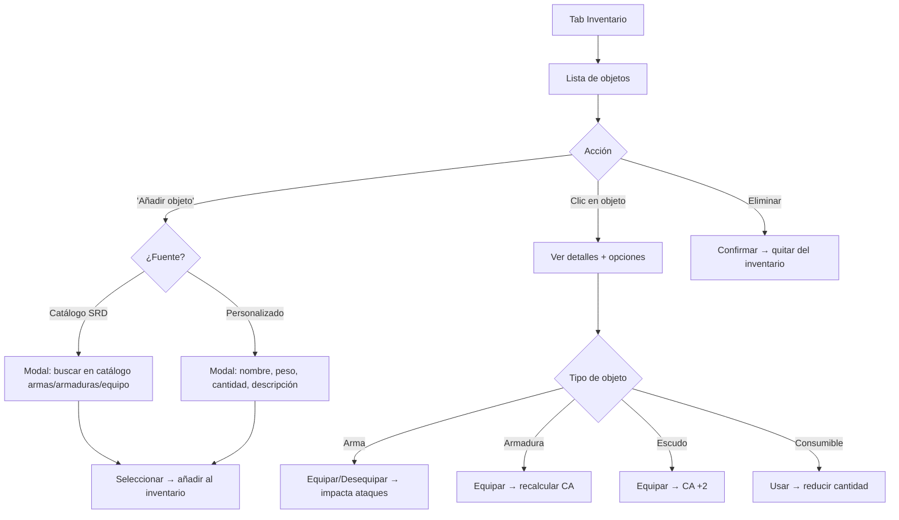
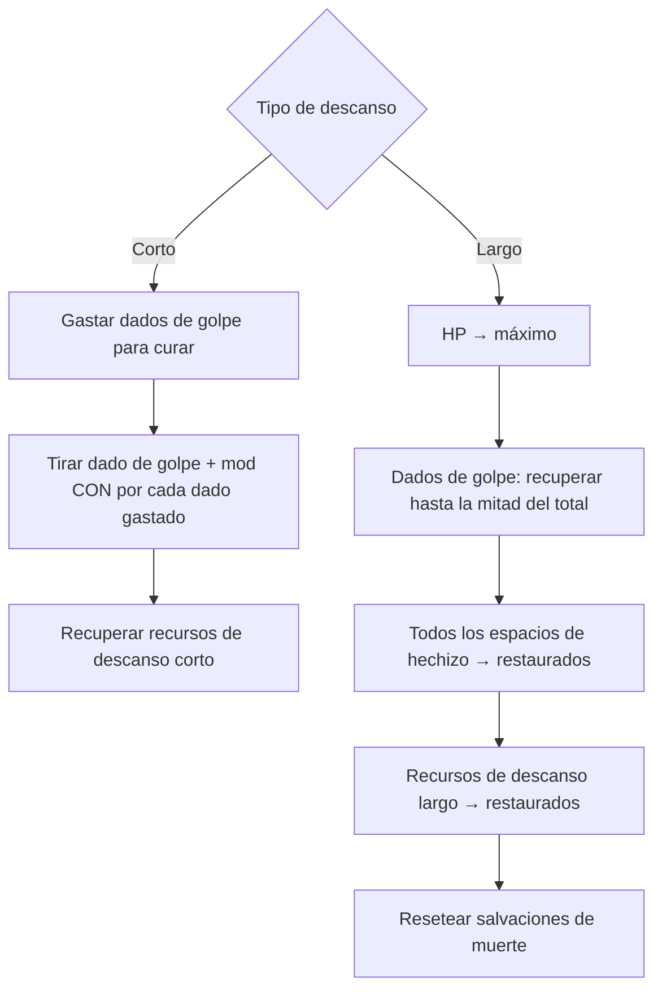
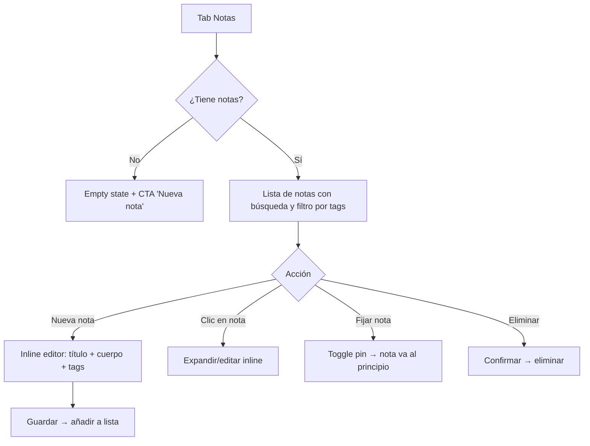

# UX Flows — DyMEs Web

> Documento de referencia de flujos de usuario para la aplicación web DyMEs (Astro + React + Tailwind + Supabase).
>
> Adaptado de las historias de usuario de la app móvil (`docs/historias_usuario/`), ajustando patrones de interacción, navegación y layout al contexto web.

---

## Índice

1. [Convenciones y notación](#1-convenciones-y-notación)
2. [Mapa de navegación global](#2-mapa-de-navegación-global)
3. [F-01 · Landing y primer contacto](#f-01--landing-y-primer-contacto)
4. [F-02 · Autenticación](#f-02--autenticación)
5. [F-03 · Shell de la aplicación (App Layout)](#f-03--shell-de-la-aplicación-app-layout)
6. [F-04 · Gestión de campañas / partidas](#f-04--gestión-de-campañas--partidas)
7. [F-05 · Creación de personaje (wizard)](#f-05--creación-de-personaje-wizard)
8. [F-06 · Hoja de personaje](#f-06--hoja-de-personaje)
9. [F-07 · Estadísticas y habilidades](#f-07--estadísticas-y-habilidades)
10. [F-08 · Subir de nivel](#f-08--subir-de-nivel)
11. [F-09 · Gestión de hechizos](#f-09--gestión-de-hechizos)
12. [F-10 · Inventario y equipamiento](#f-10--inventario-y-equipamiento)
13. [F-11 · Vida y combate](#f-11--vida-y-combate)
14. [F-12 · Notas del personaje](#f-12--notas-del-personaje)
15. [F-13 · Tirador de dados](#f-13--tirador-de-dados)
16. [F-14 · Recursos de clase](#f-14--recursos-de-clase)
17. [F-15 · Compendio SRD (público)](#f-15--compendio-srd-público)
18. [F-16 · Modo Master / DM (Premium)](#f-16--modo-master--dm-premium)
19. [F-17 · Ajustes y configuración](#f-17--ajustes-y-configuración)
20. [F-18 · Dotes (Feats)](#f-18--dotes-feats)
21. [Resumen de adaptaciones móvil → web](#resumen-de-adaptaciones-móvil--web)

---

## 1. Convenciones y notación

| Símbolo | Significado |
|---------|-------------|
| `[Pantalla]` | Página o vista identificable por URL |
| `{Componente}` | Componente React dentro de una página |
| `→` | Navegación o transición |
| `⇅` | Interacción bidireccional |
| `⌘K` | Command Palette (búsqueda global) |
| 🔒 | Requiere autenticación |
| 💎 | Funcionalidad Premium |
| `◇` | Punto de decisión |
| `✖` | Estado de error / caso límite |

**Diferencias clave respecto a la app móvil:**

| Aspecto | App Móvil (React Native) | Web (Astro) |
|---------|--------------------------|-------------|
| Navegación principal | Bottom tabs + Stack | Sidebar fija (260 px) + rutas Astro |
| Acciones rápidas | FAB (Floating Action Button) | Botones inline + Command Palette |
| Almacenamiento | AsyncStorage local | `localStorage` + Supabase |
| Gestos | Swipe, long-press | Hover, right-click, keyboard shortcuts |
| Layout | Single-column | Multi-column responsive (sidebar + main + aside) |
| Routing | React Navigation stacks | URLs estáticas Astro (`/app/*`, `/compendio/*`) |
| Tema | Automático desde OS | Class-based (`dark`/`light`) con toggle |

---

## 2. Mapa de navegación global

```
                            ┌─────────────────────────────────────────────────────────────┐
                            │                       DyMEs Web                             │
                            └─────────────┬───────────────────────────────┬───────────────┘
                                          │                               │
                          ┌───────────────▼────────────┐   ┌─────────────▼────────────────┐
                          │   ZONA PÚBLICA              │   │   ZONA AUTENTICADA  🔒       │
                          │                             │   │                              │
                          │  /                (landing) │   │  /app              (personajes)│
                          │  /login           (auth)    │   │  /app/campaigns    (campañas)│
                          │  /compendio/*     (SRD)     │   │  /app/characters/* (char)    │
                          │                             │   │  /app/account      (perfil)  │
                          │                             │   │  /app/settings     (ajustes) │
                          │                             │   │  /app/compendium   (SRD app) │
                          └─────────────────────────────┘   └──────────────────────────────┘
```

**Sidebar (AppLayout) — navegación persistente 🔒:**

```
┌──────────────────────┐
│  🏰  DyMEs           │  ← Logo, link a /app
├──────────────────────┤
│  📋  Personajes       │  → /app
│  📖  Campañas         │  → /app/campaigns
│  📚  Compendio        │  → /app/compendium
│  ⚙️  Ajustes          │  → /app/settings
├──────────────────────┤
│  👤  Mi cuenta        │  → /app/account
│  🚪  Cerrar sesión    │  → /login
└──────────────────────┘
```

---

## 3. F-01 · Landing y primer contacto

**Referencia:** Ninguna HU directa — es exclusiva de la web.
**Ruta:** `/`
**Layout:** `Layout.astro` (force dark)

### Flujo



### Pantalla

| Sección | Contenido | Interacción |
|---------|-----------|-------------|
| **Header** | Logo + nav (Inicio, Compendio, Login, Registrarse) | Sticky en scroll, blur backdrop |
| **Hero** | Título, subtítulo, CTA principal, CTA secundario | Animación de entrada (fade-up) |
| **Features** | Grid 3 columnas con iconos | Hover con glow sutil |
| **Compendio preview** | Muestra de contenido SRD | Link a `/compendio` |
| **CTA final** | Repetición de la llamada a la acción | Scroll anchor |
| **Footer** | Links legales, redes, versión | Estático |

### Estados de error / edge cases

- **JS deshabilitado:** La landing es 100 % estática (Astro), funciona sin JS.
- **Tema:** Always dark (atributo `forceDark` en Layout).

---

## 4. F-02 · Autenticación

**Referencia:** Parte de HU-10 (autenticación base necesaria para todo el app).
**Ruta:** `/login`
**Layout:** `Layout.astro` (force dark, split layout)
**Componente:** `{LoginForm}` (React, `client:load`)

### Flujo — Inicio de sesión

```mermaid
graph TD
    A[/login] --> B[Mostrar tabs: Iniciar sesión / Registrarse]
    B --> C{Tab seleccionado}
    C -->|Iniciar sesión| D[Formulario: email + contraseña]
    C -->|Registrarse| E[Formulario: nombre + email + contraseña]
    D --> F{Validación client-side}
    F -->|Campos vacíos| G[✖ 'Rellena todos los campos']
    F -->|Password < 6| H[✖ 'La contraseña debe tener al menos 6 caracteres']
    F -->|OK| I[signInWithEmail → Supabase]
    I --> J{Respuesta}
    J -->|Error| K[✖ Mostrar error inline en banner rojo]
    J -->|OK| L[window.location.href = '/app']
```

### Flujo — Registro



### Flujo — Google OAuth



### Componentes de la pantalla

```
┌─────────────────────────────────────────────────────────────┐
│                           /login                            │
├──────────────────────┬──────────────────────────────────────┤
│                      │                                      │
│     Branding panel   │        Glass card panel              │
│     (lg+ only)       │                                      │
│                      │   ┌──────────┬──────────┐            │
│   Logo + Tagline     │   │ Iniciar  │ Regist.  │  ← tabs   │
│   + badges           │   └──────────┴──────────┘            │
│                      │                                      │
│                      │   [email           ]                 │
│                      │   [contraseña   👁 ]                 │
│                      │   [nombre*         ]  ← solo regist. │
│                      │                                      │
│                      │   [ Entrar / Registrarse ]           │
│                      │                                      │
│                      │   ─── o ───                          │
│                      │                                      │
│                      │   [ 🔵 Continuar con Google ]        │
│                      │                                      │
│                      │   ¿No tienes cuenta? Regístrate      │
│                      │                                      │
└──────────────────────┴──────────────────────────────────────┘
```

### Responsive

| Breakpoint | Comportamiento |
|------------|----------------|
| `< lg` (1024 px) | Solo panel derecho ocupa toda la pantalla; logo en versión compacta arriba |
| `≥ lg` | Split 50/50 con branding izquierdo y form derecho |

### Post-autenticación

1. Se almacena la sesión de Supabase (cookie / localStorage).
2. Redirect a `/app` (lista de personajes).
3. `AppLayout` lee sesión → si no existe, redirige a `/login`.

---

## 5. F-03 · Shell de la aplicación (App Layout)

**Referencia:** Transversal a todas las HU.
**Layout:** `AppLayout.astro`
**Protección:** 🔒 Requiere sesión activa.

### Estructura responsive

```
Desktop (≥ 1024 px)                       Mobile (< 1024 px)
┌──────┬──────────────────────┐           ┌──────────────────────────┐
│      │                      │           │ [☰] DyMEs    [👤] [🔔]  │
│ Side │     Main Content     │           ├──────────────────────────┤
│ bar  │                      │           │                          │
│ 260px│                      │           │     Main Content         │
│      │                      │           │     (full width)         │
│      │                      │           │                          │
│      │                      │           └──────────────────────────┘
│      │                      │           ↕ Sidebar como drawer overlay
└──────┴──────────────────────┘
```

### Sidebar

| Elemento | Descripción |
|----------|-------------|
| **Logo** | `favicon.svg` + "DyMEs", link a `/app` |
| **Nav principal** | Personajes, Campañas, Compendio, Ajustes |
| **Nav secundario** | Mi cuenta, Cerrar sesión |
| **Indicador activo** | Highlight de fondo + borde izquierdo en item actual |
| **Colapso** | En mobile: drawer con overlay backdrop; toggle vía hamburger |

### Header (mobile)

| Elemento | Descripción |
|----------|-------------|
| **Hamburger** | Abre/cierra sidebar drawer |
| **Título** | Nombre de la sección actual |
| **Acciones** | Avatar / notificaciones (futuro) |

### Transiciones

- Navegación entre secciones: fade-in del contenido (`animate-fade-in`).
- No hay transición de página completa (Astro hace full page navigation, pero el layout persiste visualmente).

---

## 6. F-04 · Gestión de campañas / partidas

**Referencia:** HU-01
**Ruta:** `/app/campaigns`
**Componente:** `{CampaignList}` (React, `client:load`)
**Prioridad:** 🔴 Alta — MVP

### Flujo principal

```mermaid
graph TD
    A[/app/campaigns] --> B{¿Tiene campañas?}
    B -->|No| C[Empty state: ilustración + CTA 'Nueva Campaña']
    B -->|Sí| D[Lista filtrable de campañas]
    D --> E[Barra de búsqueda]
    E --> F[Filtrar por nombre en tiempo real]
    D --> G{Acción}
    G -->|Clic en campaña| H[Expandir / ver detalles inline]
    G -->|'Nueva Campaña'| I[Modal de creación]
    G -->|Eliminar| J[Modal confirmación → eliminar]
    I --> K[Form: nombre + descripción]
    K --> L{Validar}
    L -->|Nombre vacío| M[✖ Botón deshabilitado]
    L -->|OK| N[createCampaign → Supabase]
    N --> O[Se añade a lista → cierra modal]
```

### Componentes de pantalla

```
┌──────────────────────────────────────────────────────────────────┐
│  📖 Gestión de partidas                                         │
│  Campañas                              [ + Nueva Campaña ]      │
│  3 campañas activas                                             │
├──────────────────────────────────────────────────────────────────┤
│  🔍 [Buscar campañas...             ]                           │
├──────────────────────────────────────────────────────────────────┤
│                                                                  │
│  ┌──────────────────────────────────────────────────────────┐   │
│  │ 📖 La Maldición de Strahd                                │   │
│  │    Campaña de terror gótico en Barovia                    │   │
│  │    Creada: 15 ene 2025                     [🗑️ Eliminar] │   │
│  └──────────────────────────────────────────────────────────┘   │
│                                                                  │
│  ┌──────────────────────────────────────────────────────────┐   │
│  │ 📖 Minas de Fandelver                                    │   │
│  │    Aventura introductoria                                 │   │
│  │    Creada: 3 dic 2024                      [🗑️ Eliminar] │   │
│  └──────────────────────────────────────────────────────────┘   │
│                                                                  │
└──────────────────────────────────────────────────────────────────┘
```

### Adaptación web vs móvil

| Móvil | Web |
|-------|-----|
| FlatList con scroll | Grid/lista con scroll nativo del navegador |
| Swipe para eliminar | Botón de eliminar visible + modal confirmación |
| Bottom sheet para crear | Modal centrado con backdrop |

### Estados

| Estado | Presentación |
|--------|-------------|
| **Cargando** | Spinner centrado + texto "Cargando campañas..." |
| **Vacío** | Ilustración vacía + texto motivacional + CTA grande |
| **Con datos** | Filas de campañas con búsqueda |
| **Error red** | Banner inline de error con retry |

---

## 7. F-05 · Creación de personaje (wizard)

**Referencia:** HU-02
**Ruta:** `/app/characters/create`
**Componente:** `{CharacterCreation}` (React, `client:load`)
**Prioridad:** 🔴 Alta — MVP

### Flujo del wizard

```mermaid
graph TD
    A[/app/characters/create] --> B[Step 1: Nombre ✏️]
    B --> C{nombre.length ≥ 2?}
    C -->|No| D[Botón 'Siguiente' deshabilitado]
    C -->|Sí| E[Step 2: Raza 🧝]
    E --> F{Raza seleccionada?}
    F -->|No| G[Botón deshabilitado]
    F -->|Sí| H[Step 3: Clase ⚔️]
    H --> I{Clase seleccionada?}
    I -->|No| J[Botón deshabilitado]
    I -->|Sí| K[Step 4: Características 🎯]
    K --> L[Standard Array: asignar 15,14,13,12,10,8]
    L --> M[Step 5: Resumen 📋]
    M --> N{Confirmar?}
    N -->|Atrás| O[Volver a cualquier paso previo]
    N -->|Crear| P[Generar Character → localStorage]
    P --> Q[→ /app/characters/view?id=xxx]
```

### Detalle de pasos

#### Paso 1 — Nombre

```
┌──────────────────────────────────────────────┐
│  ← Volver                                    │
│                                              │
│  Crear Personaje                             │
│  Completa los pasos para dar vida a tu héroe │
│                                              │
│  [✏️ Nombre] ─ [🧝 Raza] ─ [⚔️ Clase]      │
│  ─ [🎯 Caract.] ─ [📋 Resumen]              │
│                                              │
│  ┌────────────────────────────────┐          │
│  │ ¿Cómo se llama tu personaje?  │          │
│  │                                │          │
│  │ [Nombre del personaje...    ]  │          │
│  └────────────────────────────────┘          │
│                                              │
│           [← Atrás]  [Siguiente →]           │
└──────────────────────────────────────────────┘
```

#### Paso 2 — Raza

- Grid de 9 razas SRD (`humano`, `elfo`, `enano`, `mediano`, `draconido`, `gnomo`, `semielfo`, `semiorco`, `tiefling`).
- Cada card: emoji/icono + nombre localizado.
- Selección visual con borde highlight (rojo-dorado).
- **Futuro:** Subrazas desplegables al seleccionar (ej: Elfo alto, Elfo del bosque, Drow).

#### Paso 3 — Clase

- Grid de 12 clases SRD (`bárbaro` → `pícaro`).
- Cards con icono de clase (`CLASS_ICONS`) + nombre localizado (`CLASS_NAMES`).

#### Paso 4 — Características (Ability Scores)

- **Método actual:** Standard Array (15, 14, 13, 12, 10, 8) con selectores por habilidad.
- **Futuro:** Toggle entre 4 métodos (Standard Array, Point Buy, Tirada 4d6kh3, Manual).
- 6 filas: FUE, DES, CON, INT, SAB, CAR → cada una con selector de valor.
- Muestra modificador calculado junto al valor.

#### Paso 5 — Resumen

- Resumen visual: nombre, raza, clase, nivel 1.
- Tabla de ability scores con modificadores.
- Botón "Crear personaje" → genera UUID, construye objeto `Character`, guarda en localStorage, redirige.

### Validaciones

| Paso | Requisito | Feedback |
|------|-----------|----------|
| Nombre | ≥ 2 caracteres | Botón deshabilitado + hint |
| Raza | Selección requerida | Botón deshabilitado |
| Clase | Selección requerida | Botón deshabilitado |
| Características | Pre-asignadas (siempre válido) | — |
| Resumen | Confirmación | Botón "Crear" con loading state |

### Adaptación web vs móvil

| Móvil | Web |
|-------|-----|
| Swipe horizontal entre pasos | Stepper horizontal + botones Atrás/Siguiente |
| Scroll vertical dentro de cada paso | Contenido fijo con scroll interno si necesario |
| Persistencia en AsyncStorage | Persistencia en `localStorage` (STORAGE_KEYS.CHARACTER) |
| Navegación con React Navigation | URL fija `/app/characters/create`, estado en React state |

---

## 8. F-06 · Hoja de personaje

**Referencia:** HU-03
**Ruta:** `/app/characters/view?id={uuid}`
**Componente:** `{CharacterSheet}` / `{CharacterSheetPage}` (React, `client:load`)
**Prioridad:** 🔴 Alta — MVP

### Flujo de acceso

```mermaid
graph TD
    A[/app → lista de personajes] --> B[Clic en personaje]
    B --> C[→ /app/characters/view?id=xxx]
    C --> D{¿Existe en localStorage?}
    D -->|No| E[Pantalla 'Personaje no encontrado' + CTA 'Volver']
    D -->|Sí| F[Cargar Character → mostrar hoja]
    F --> G[Tab 'General' activa por defecto]
```

### Estructura de tabs

```
┌──────────────────────────────────────────────────────────────────┐
│  ← Mis Personajes                                                │
│                                                                  │
│  ┌────────────────────────────────────────────────────────┐      │
│  │  [Avatar/Icono]                                        │      │
│  │  Thorin Escudo de Roble                                │      │
│  │  Enano · Guerrero · Nivel 5                            │      │
│  │  ████████████████░░░░ 35/42 PG                         │      │
│  └────────────────────────────────────────────────────────┘      │
│                                                                  │
│  [📋 General] [⚔️ Combate] [✨ Hechizos] [🎒 Inventario] [📝 Notas]  │
│  ─────────────────────────────────────────────────────           │
│                                                                  │
│  ┌─── Contenido de la tab activa ──────────────────────┐        │
│  │                                                      │        │
│  │  (Ver secciones detalladas abajo)                    │        │
│  │                                                      │        │
│  └──────────────────────────────────────────────────────┘        │
└──────────────────────────────────────────────────────────────────┘
```

### Tab General

| Sección | Contenido |
|---------|-----------|
| **Header** | Avatar, nombre, raza, clase, nivel, barra de HP |
| **Ability Scores** | Grid 3×2 con valor total, modificador, y salvación |
| **Habilidades (Skills)** | Lista de 18 skills con bonus calculado, icono de proficiencia |
| **Rasgos y competencias** | Lista de traits, idiomas, proficiencias |
| **Personalidad** | Rasgos, ideales, vínculos, defectos |

### Tab Combate

| Sección | Contenido |
|---------|-----------|
| **HP** | Barra visual + current/max/temp + botones daño/curación |
| **CA (Armor Class)** | Valor calculado según equipo |
| **Iniciativa** | Modificador de DES + proficiencia |
| **Dados de golpe** | Tipo + restantes/total + botón descanso corto |
| **Salvaciones de muerte** | 3 éxitos / 3 fracasos con toggles |
| **Condiciones** | Lista de condiciones activas |

### Tab Hechizos

| Sección | Contenido |
|---------|-----------|
| **Espacios de hechizo** | Slots por nivel con indicadores usados/total |
| **Hechizos conocidos/preparados** | Lista agrupada por nivel |
| **Trucos** | Lista separada de cantrips |
| **Acciones** | Lanzar (gasta slot), preparar/descartar |

### Tab Inventario

| Sección | Contenido |
|---------|-----------|
| **Objetos** | Lista con peso, cantidad, tipo |
| **Equipo** | Armas/armadura/escudo equipados |
| **Monedas** | po, pp, pe, pl, pc |
| **Carga** | Peso actual vs capacidad |

### Tab Notas

| Sección | Contenido |
|---------|-----------|
| **Lista de notas** | Filtrable por tags (NPC, Ubicación, Misión, etc.) |
| **Crear/editar** | Editor inline con título + cuerpo + tags |
| **Notas fijadas** | Se muestran primero |

### Adaptación web

| Aspecto | Móvil | Web |
|---------|-------|-----|
| Navegación tabs | Swipeable horizontal | Click-based tabs con underline animada |
| Secciones | Scroll vertical colapsable (Accordion) | Scroll vertical o 2-column en pantallas anchas |
| Edición | Modales fullscreen | Modales centrados o inline editing |
| URL | Stack de React Navigation | Query param `?id=xxx` |

---

## 9. F-07 · Estadísticas y habilidades

**Referencia:** HU-04
**Prioridad:** 🔴 Alta — MVP
**Ubicación:** Tab "General" de la hoja de personaje

### Flujo de consulta y edición

```mermaid
graph TD
    A[Tab General → sección Ability Scores] --> B[Grid 3×2: FUE, DES, CON, INT, SAB, CAR]
    B --> C[Cada card muestra: valor total, modificador, salvación]
    C --> D{Clic en ability}
    D -->|Consultar| E[Tooltip o popover con desglose: base + racial + ASI + misc]
    D -->|Editar| F[Modal edición: ajustar base, racial, misc]
    F --> G[Recalcular modifier = floor(total - 10 / 2)]
    G --> H[Actualizar skills y salvaciones derivadas]
```

### Cálculos automáticos

| Dato | Fórmula |
|------|---------|
| Modificador | `Math.floor((total - 10) / 2)` |
| Bonus de habilidad | `modificador + (proficient ? proficiencyBonus : 0)` |
| Percepción pasiva | `10 + bonus de Percepción` |
| Bonus de competencia | Por nivel: N1-4: +2, N5-8: +3, N9-12: +4, N13-16: +5, N17-20: +6 |

### Habilidades (Skills)

```
┌────────────────────────────────────────┐
│  Habilidades                           │
├────────────────────────────────────────┤
│  ● Acrobacias (DES)          +5       │  ← ● = proficiente
│  ○ Atletismo (FUE)           +1       │  ← ○ = no proficiente
│  ◉ Sigilo (DES)              +8       │  ← ◉ = expertise
│  ○ Arcanos (INT)             +0       │
│  ...                                   │
├────────────────────────────────────────┤
│  Percepción Pasiva: 14                 │
└────────────────────────────────────────┘
```

---

## 10. F-08 · Subir de nivel

**Referencia:** HU-05
**Prioridad:** 🔴 Alta — MVP
**Trigger:** Botón "Subir de nivel" en la cabecera del character sheet.

### Flujo

```mermaid
graph TD
    A[Character sheet → botón 'Subir de nivel'] --> B[Modal/panel de level up]
    B --> C[Nivel actual → Nivel +1]
    C --> D[Paso 1: HP]
    D --> E{Método}
    E -->|Fijo| F[Valor fijo del dado de golpe + CON mod]
    E -->|Tirada| G[Tirar dado de golpe + CON mod]
    D --> H[Paso 2: ¿Hay mejora de puntuación (ASI)?]
    H -->|Sí, nivel 4/8/12/16/19| I{¿ASI o Dote?}
    I -->|ASI| J[+2 a una habilidad o +1/+1]
    I -->|Dote| K[Seleccionar de catálogo de dotes]
    H -->|No| L[Paso 3: Rasgos de clase]
    J --> L
    K --> L
    L --> M[Mostrar nuevos rasgos desbloqueados]
    M --> N{¿Nivel de subclase?}
    N -->|Sí| O[Seleccionar/confirmar subclase]
    N -->|No| P[Paso 4: Hechizos]
    O --> P
    P --> Q{¿Clase lanzadora?}
    Q -->|Sí| R[Nuevos slots + aprender/olvidar hechizos]
    Q -->|No| S[Skip]
    R --> T[Resumen de cambios]
    S --> T
    T --> U{Confirmar}
    U -->|Sí| V[Aplicar cambios → guardar → actualizar sheet]
    U -->|Cancelar| W[Descartar y cerrar]
```

### Rasgos por nivel (ejemplos)

| Clase | Nivel | Rasgo desbloqueado |
|-------|-------|-------------------|
| Guerrero | 3 | Elección de subclase (Campeón, Maestro de batalla, Caballero arcano) |
| Bárbaro | 2 | Ataque temerario, Percibir peligro |
| Mago | 2 | Tradición arcana (subclase) |
| Pícaro | 3 | Arquetipo de pícaro (subclase) |

### Adaptación web

- **Móvil:** Wizard fullscreen, paso a paso.
- **Web:** Modal/drawer lateral ancho (max-width 640 px) con stepper vertical, preview de cambios en tiempo real.

---

## 11. F-09 · Gestión de hechizos

**Referencia:** HU-06
**Prioridad:** 🔴 Alta — MVP
**Ubicación:** Tab "Hechizos" de la hoja de personaje

### Flujo de consulta

```mermaid
graph TD
    A[Tab Hechizos] --> B[Mostrar espacios de hechizo por nivel]
    B --> C[Lista de hechizos conocidos / preparados]
    C --> D{Acción}
    D -->|Clic en hechizo| E[Expandir detalles: descripción, componentes, rango, duración]
    D -->|'Lanzar'| F[Seleccionar nivel de slot → gastar slot]
    D -->|'Preparar/Descartar'| G[Toggle preparación (solo clases preparadoras)]
    D -->|'Añadir hechizo'| H[Browser de hechizos por clase]
```

### Flujo de lanzamiento



### Tipos de magia por clase

| Tipo | Clases | Mecánica web |
|------|--------|-------------|
| **Conocidos** | Bardo, Brujo, Hechicero, Explorador | Lista fija, cambiar al subir nivel |
| **Preparados** | Clérigo, Druida, Paladín | Toggle diario, max = mod habilidad + nivel |
| **Libro de hechizos** | Mago | Spellbook (todos aprendidos) + preparados (subconjunto) |
| **Magia de pacto** | Brujo | Pocos slots, se recuperan en descanso corto |

### Adaptación web

- **Browser de hechizos:** Modal grande con filtros (nivel, escuela, ritual, concentración, clase) — reutiliza la lógica del Compendio.
- **Spell cards:** Diseño responsive, 1-2 columnas según ancho.

---

## 12. F-10 · Inventario y equipamiento

**Referencia:** HU-07
**Prioridad:** 🔴 Alta — MVP
**Ubicación:** Tab "Inventario" de la hoja de personaje

### Flujo principal



### Cálculo de CA

| Armadura | Fórmula CA |
|----------|-----------|
| Sin armadura | `10 + mod DES` |
| Ligera | `base + mod DES` |
| Media | `base + min(mod DES, 2)` |
| Pesada | `base` (sin DES) |
| + Escudo | `+2` al total |

### Layout

```
┌──────────────────────────────────────────┐
│  Inventario                   [+ Añadir] │
├──────────────────────────────────────────┤
│  Equipado:                               │
│  ⚔️ Espada larga (1d8 cortante)  [×]    │
│  🛡 Escudo (+2 CA)               [×]    │
│  🦺 Cota de mallas (CA 16)      [×]    │
├──────────────────────────────────────────┤
│  Mochila:                                │
│  📦 Cuerda (15 m)        ×1    0.5 kg   │
│  📦 Raciones             ×5    5.0 kg   │
│  📦 Antorcha             ×3    1.5 kg   │
├──────────────────────────────────────────┤
│  💰 15 po · 3 pp · 0 pe · 0 pl · 8 pc  │
│  📏 Peso: 22.5 / 120 kg                 │
└──────────────────────────────────────────┘
```

---

## 13. F-11 · Vida y combate

**Referencia:** HU-08
**Prioridad:** 🔴 Alta — MVP
**Ubicación:** Tab "Combate" de la hoja de personaje

### Flujo de gestión de HP

```mermaid
graph TD
    A[Sección HP] --> B[Barra visual: current / max]
    B --> C{Acción}
    C -->|Recibir daño| D[Input numérico → restar]
    D --> E{¿Tiene HP temporal?}
    E -->|Sí| F[Absorber con temp HP primero]
    E -->|No| G[Restar de HP actual]
    F --> G
    G --> H{¿HP ≤ 0?}
    H -->|Sí| I[HP = 0, activar salvaciones de muerte]
    H -->|No| J[Actualizar barra]
    C -->|Curar| K[Input numérico → sumar (max = HP max)]
    C -->|HP temporal| L[Input → set temp HP (no se acumula)]
```

### Barra de HP — colores

| Rango | Color | Clase CSS |
|-------|-------|-----------|
| 100–51 % | Verde | `bg-green-500` |
| 50–26 % | Amarillo | `bg-yellow-500` |
| 25–1 % | Rojo | `bg-red-500` |
| 0 % | Gris oscuro | `bg-gray-700` |

### Descansos



### Salvaciones de muerte

```
┌──────────────────────────────┐
│  Salvaciones de muerte       │
│                              │
│  Éxitos:   ● ● ○            │
│  Fracasos: ● ○ ○            │
│                              │
│  3 éxitos → estabilizado     │
│  3 fracasos → muerto         │
└──────────────────────────────┘
```

### Condiciones activas

Lista de condiciones SRD aplicables: Cegado, Ensordecido, Asustado, Agarrado, Incapacitado, Invisible, Paralizado, Petrificado, Envenenado, Tumbado, Restringido, Aturdido, Inconsciente.

Cada condición: toggle on/off con icono + tooltip con reglas.

---

## 14. F-12 · Notas del personaje

**Referencia:** HU-09
**Prioridad:** 🟡 Media — MVP
**Ubicación:** Tab "Notas" de la hoja de personaje

### Flujo



### Tags disponibles

| Tag | Icono | Uso |
|-----|-------|-----|
| NPC | 👤 | Personajes no jugadores |
| Ubicación | 📍 | Lugares visitados |
| Misión | ⚔️ | Quests y objetivos |
| Objeto | 📦 | Items y tesoros encontrados |
| Lore | 📜 | Información del mundo |
| Sesión | 📖 | Resúmenes de sesión |
| Libre | 🏷️ | Etiqueta genérica |

### Layout web

```
┌────────────────────────────────────────────────────┐
│  Notas                              [+ Nueva nota] │
│  🔍 [Buscar...]  [Todos ▾] ← filtro por tag       │
├────────────────────────────────────────────────────┤
│  📌 Resumen sesión 3  [📖 Sesión]   hace 2 días   │
│  📌 El tabernero sospechoso [👤 NPC]  hace 1 sem  │
│  ─────────────────────────────────────────         │
│  La cripta del bosque  [📍 Ubicación]  hace 1 sem  │
│  Buscar el amuleto perdido [⚔️ Misión]  hace 2 sem │
└────────────────────────────────────────────────────┘
```

---

## 15. F-13 · Tirador de dados

**Referencia:** HU-11
**Prioridad:** 🔴 Alta — MVP
**Trigger:** Botón persistente / accesible desde cualquier página del app (header o sidebar)

### Adaptación web del FAB

En la app móvil el tirador es un FAB (Floating Action Button) global. En la web:

| Opción | Descripción |
|--------|-------------|
| **Popover/Drawer** | Icono de dado 🎲 en el header/sidebar → abre panel flotante lateral |
| **Command Palette** | Integrar fórmulas de dados en `⌘K` |
| **Panel fijo** | Panel colapsable en el sidebar (debajo de la nav) |

> **Recomendación:** Panel floating (drawer derecho) activado por icono en header/sidebar. No bloquea la navegación, permite tirar mientras se consulta la hoja.

### Flujo principal

```mermaid
graph TD
    A[Clic en 🎲 → abrir tirador] --> B[Panel lateral/popover]
    B --> C{Modo}
    C -->|Rápido| D[Botones preset: d4, d6, d8, d10, d12, d20, d100]
    D --> E[Clic → tirar → mostrar resultado con animación]
    C -->|Fórmula| F[Input: ej. '2d6+3', '4d6kh3']
    F --> G[Parser → validar]
    G -->|Válido| H[Tirar → mostrar resultado + desglose]
    G -->|Inválido| I[✖ 'Fórmula no válida']
    C -->|Ventaja/Desventaja| J[Toggle: Normal / Ventaja / Desventaja]
    J --> K[Tirar 2d20, tomar mayor/menor]
    B --> L[Historial de tiradas reciente (últimas 10-20)]
```

### Presets vinculados al personaje

Cuando el tirador se abre desde la hoja de un personaje, mostrar presets contextuales:

| Preset | Fórmula | Origen |
|--------|---------|--------|
| Ataque con espada larga | 1d20+5 | mod FUE + proficiency |
| Daño espada larga | 1d8+3 | mod FUE |
| Salvación de CON | 1d20+4 | mod CON + proficiency (si proficient) |
| Iniciativa | 1d20+2 | mod DES |

### Resultado visual

```
┌──────────────────────────────┐
│  🎲 Tirador de Dados         │
│                              │
│  [d4][d6][d8][d10][d12][d20] │
│                              │
│  Fórmula: [2d6+3         ]  │
│  [Normal ▾]  [🎲 Tirar]     │
│                              │
│  ──── Resultado ────         │
│         ╔═══╗                │
│         ║ 9 ║  2d6+3        │
│         ╚═══╝                │
│  Dados: [3] [3] +3          │
│                              │
│  ──── Historial ────         │
│  d20 → 17  (hace 2 min)     │
│  2d6+3 → 9  (hace 5 min)    │
│  d20 (Ventaja) → 18 [14,18] │
└──────────────────────────────┘
```

---

## 16. F-14 · Recursos de clase

**Referencia:** HU-12
**Prioridad:** 🔴 Alta — MVP
**Ubicación:** Panel dentro de Tab "General" o "Combate" de la hoja de personaje

### Recursos por clase

| Clase | Recurso | Dado/Pool | Recuperación |
|-------|---------|-----------|-------------|
| Bárbaro | Furia | Usos (2-6 según nivel) | Descanso largo |
| Bardo | Inspiración Bárdica | Usos = mod CAR | Descanso largo (corto a N5+) |
| Monje | Ki | Puntos = nivel | Descanso corto |
| Hechicero | Puntos de Hechicería | Puntos = nivel | Descanso largo |
| Paladín | Imposición de Manos | Pool = nivel × 5 | Descanso largo |
| Clérigo | Canalizar Divinidad | 1 uso (2 a N6, 3 a N18) | Descanso corto |
| Druida | Forma Salvaje | 2 usos | Descanso corto |
| Guerrero | Segundo Aliento | 1 uso | Descanso corto |
| Guerrero | Oleada de Acción | 1 uso (2 a N17) | Descanso corto |

### Flujo

```mermaid
graph TD
    A[Panel de recursos de clase] --> B[Mostrar recursos disponibles según clase+nivel]
    B --> C{Acción}
    C -->|Gastar| D[Clic en '-' → restar 1 uso]
    D --> E{¿Quedan usos?}
    E -->|No| F[Recurso agotado (visualmente gris/rojo)]
    E -->|Sí| G[Actualizar contador]
    C -->|Recuperar manual| H[Clic en '+' → sumar 1 uso]
    C -->|Descanso| I[Auto-recuperar según tipo de descanso]
```

### Layout

```
┌────────────────────────────────────────┐
│  Recursos de Clase                     │
├────────────────────────────────────────┤
│  🔥 Furia          ●●●○○  3/5 usos    │
│                     [-]  [+]           │
│  ⚡ Atq. Temerario  Siempre disponible │
│  💨 Oleada Acción   ●○    1/1 uso      │
│                     [-]  [+]           │
└────────────────────────────────────────┘
```

---

## 17. F-15 · Compendio SRD (público)

**Referencia:** HU-13
**Rutas:** `/compendio/*` (público) + `/app/compendium` (autenticado, con extras)
**Layout:** `CompendioLayout.astro` (sidebar + TOC + main)
**Prioridad:** 🟡 Media — MVP

### Estructura de navegación

```
/compendio/
├── index          → Página principal con categorías
├── razas/
│   ├── index      → Grid de 9 razas
│   └── [id]       → Detalle de raza (subraza incluida)
├── clases/
│   ├── index      → Grid de 12 clases
│   ├── [id]       → Detalle de clase
│   └── subclase/
│       └── [id]   → Detalle de subclase
├── trasfondos/
│   ├── index      → Grid de trasfondos
│   └── [id]       → Detalle
├── conjuros       → Tabla filtrable de hechizos
└── reglas/
    └── index      → Reglas básicas del SRD
```

### Flujo principal

```mermaid
graph TD
    A[/compendio] --> B[Grid de categorías: Razas, Clases, Trasfondos, Conjuros, Reglas]
    B --> C{Categoría}
    C -->|Razas| D[Grid de 9 razas con cards]
    C -->|Clases| E[Grid de 12 clases con cards]
    C -->|Trasfondos| F[Grid de trasfondos]
    C -->|Conjuros| G[Tabla con filtros avanzados]
    C -->|Reglas| H[Página de reglas con sidebar TOC]
    D --> I[/compendio/razas/elfo → detalle]
    E --> J[/compendio/clases/guerrero → detalle]
    J --> K[Link a subclase → /compendio/clases/subclase/campeon]
    G --> L{Filtros}
    L --> M[Por nivel: 0-9]
    L --> N[Por escuela: Abjuración, Conjuración, etc.]
    L --> O[Por clase: las 12 clases]
    L --> P[Ritual: sí/no]
    L --> Q[Concentración: sí/no]
    G --> R[Clic en hechizo → expandir detalles inline o modal]
```

### Layout del Compendio

```
Desktop
┌──────────┬─────────────────────────────────┬──────────┐
│ Sidebar  │         Main Content            │   TOC    │
│ (nav +   │                                 │ (table   │
│  search) │  Título                         │  of      │
│          │  Contenido del artículo         │  contents│
│ Categorías│  con secciones                │  links)  │
│ expandibles│                               │          │
│          │                                 │          │
└──────────┴─────────────────────────────────┴──────────┘

Mobile
┌──────────────────────────────────┐
│  [☰] Compendio SRD   [🔍]      │
├──────────────────────────────────┤
│                                  │
│  Main Content                    │
│  (sidebar as drawer,             │
│   TOC as dropdown)               │
│                                  │
└──────────────────────────────────┘
```

### Búsqueda

- **Command Palette (`⌘K`)**: Búsqueda global desde cualquier página del compendio.
- **Sidebar search**: Input de búsqueda en la sidebar para filtrar artículos.
- **Filtros avanzados**: Solo en la página de conjuros (nivel, escuela, clase, ritual, concentración).

---

## 18. F-16 · Modo Master / DM (Premium)

**Referencia:** HU-10
**Prioridad:** 🔴 Alta — Post-MVP 💎
**Rutas futuras:** `/app/master/*`

### Flujo de activación

```mermaid
graph TD
    A[/app/settings o /app/account] --> B{¿Tiene suscripción Premium?}
    B -->|No| C[Mostrar upsell: funcionalidades Master]
    C --> D[Botón 'Suscribirse' → flujo de pago (Stripe/similar)]
    D --> E[Activar Premium en Supabase user metadata]
    B -->|Sí| F[Mostrar toggle: Modo Jugador / Modo Master]
    F --> G{Selección}
    G -->|Jugador| H[App normal — campañas y personajes propios]
    G -->|Master| I[Dashboard de Master]
```

### Dashboard de Master

```mermaid
graph TD
    A[Dashboard Master] --> B[Lista de campañas del Master]
    B --> C{Acción}
    C -->|Nueva campaña| D[Crear campaña con código de invitación (6-8 chars)]
    C -->|Ver campaña| E[Detalle de campaña]
    E --> F[Lista de jugadores unidos]
    F --> G[Clic en jugador → ver su personaje en TIEMPO REAL]
    G --> H[Supabase Realtime → cambios reflejados al instante]
    C -->|Enviar nota| I[Escribir nota → push a jugadores de la campaña]
    C -->|Código| J[Mostrar/regenerar código de invitación]
```

### Unirse a campaña (jugador)

```mermaid
graph TD
    A[Jugador en /app/campaigns] --> B[Botón 'Unirse a campaña']
    B --> C[Input: código de invitación]
    C --> D{Código válido?}
    D -->|No| E[✖ 'Código no encontrado']
    D -->|Sí| F[Unirse → seleccionar personaje para la campaña]
    F --> G[Supabase sync activado para ese personaje]
```

### Adaptación web

| Aspecto | Móvil | Web |
|---------|-------|-----|
| Vista de personaje del jugador | Modal fullscreen | Panel lateral o nueva pestaña/ventana |
| Supabase Realtime | Misma implementación | Misma implementación (WebSockets nativos) |
| Notificaciones | Push notification | In-app notification banner (futuro: Web Push API) |

---

## 19. F-17 · Ajustes y configuración

**Referencia:** HU-14
**Ruta:** `/app/settings`
**Componente:** `{SettingsPanel}` (React, `client:load`)
**Prioridad:** 🟡 Media — MVP

### Secciones

```mermaid
graph TD
    A[/app/settings] --> B[Secciones de ajustes]
    B --> C[🎨 Apariencia: tema claro/oscuro/auto]
    B --> D[📏 Unidades: métrico/imperial]
    B --> E[📜 Reglas opcionales]
    B --> F[💾 Datos]
    B --> G[ℹ️ Acerca de]
```

### Tema visual

```
┌──────────────────────────────────────┐
│  Apariencia                          │
│                                      │
│  Tema: [☀️ Claro] [🌙 Oscuro] [🔄 Auto]  │
│                                      │
│  ► Claro: paleta cálida pergamino    │
│  ► Oscuro: paleta mazmorra oscura    │
│  ► Auto: según preferencia del OS    │
└──────────────────────────────────────┘
```

**Implementación web:**
- Clase `dark` en `<html>` → controlada por toggle.
- Persiste en `localStorage` (`theme` key).
- CSS Custom Properties cambian según `.dark` / no `.dark`.

### Reglas opcionales

| Regla | Default | Efecto |
|-------|---------|--------|
| Dotes (Feats) | Off | Habilita selección de dotes en ASI |
| Multiclase | Off | Futuro: permite más de una clase |
| HP fijo al subir | On | Usa valor fijo en vez de tirada |
| Compra de puntos | Off | Método de generación de ability scores |
| Carga (Encumbrance) | Off | Activa sistema de peso/carga |

### Datos

| Acción | Descripción |
|--------|-------------|
| **Exportar JSON** | Descargar todos los datos (personajes, campañas, notas) como `.json` |
| **Importar JSON** | Subir archivo `.json` → validar → merge/replace datos |
| **Eliminar datos** | Doble confirmación → borrar todo localStorage + Supabase data |

### Flujo de exportación

```mermaid
graph TD
    A[Clic 'Exportar datos'] --> B[Recopilar: personajes + campañas + settings]
    B --> C[Generar JSON con metadatos: versión, fecha, usuario]
    C --> D[Trigger descarga como 'dymes-backup-YYYY-MM-DD.json']
```

### Flujo de importación

```mermaid
graph TD
    A[Clic 'Importar datos'] --> B[File picker → seleccionar .json]
    B --> C{Validar estructura}
    C -->|Inválido| D[✖ 'Archivo no compatible']
    C -->|Válido| E{¿Tiene datos existentes?}
    E -->|Sí| F[Confirmar: '¿Reemplazar o fusionar?']
    E -->|No| G[Importar directamente]
    F -->|Reemplazar| H[Borrar existentes → importar]
    F -->|Fusionar| I[Merge por ID → importar nuevos, actualizar existentes]
    G --> J[✅ 'Datos importados correctamente']
    H --> J
    I --> J
```

---

## 20. F-18 · Dotes (Feats)

**Referencia:** HU-15
**Prioridad:** 🟡 Media — Post-MVP
**Ubicación:** Catálogo en Compendio + selección en Level Up (ASI)

### Catálogo de dotes

21 dotes del SRD disponibles. Cada dote tiene:

| Campo | Descripción |
|-------|-------------|
| Nombre | Nombre traducido al español |
| Prerequisito | Requisito (ej: FUE 13, lanzar hechizos, etc.) |
| Descripción | Texto completo del SRD |
| Efectos mecánicos | Cambios automáticos (ej: +1 a habilidad, proficiencia extra) |

### Flujo de selección (en Level Up)

```mermaid
graph TD
    A[Level Up → paso ASI] --> B{¿Regla 'Dotes' activada en Settings?}
    B -->|No| C[Solo mostrar opción ASI (+2/+1+1)]
    B -->|Sí| D[Mostrar: ASI o Dote]
    D --> E{Elección}
    E -->|ASI| F[Distribuir +2 o +1/+1 en abilities]
    E -->|Dote| G[Abrir catálogo de dotes]
    G --> H[Filtrar: solo dotes cuyos prerequisitos cumple el personaje]
    H --> I[Seleccionar dote]
    I --> J[Preview de efectos mecánicos]
    J --> K{Confirmar?}
    K -->|Sí| L[Aplicar dote: añadir a traits + aplicar bonuses]
    K -->|No| M[Volver a catálogo]
```

### Efectos auto-aplicados (ejemplos)

| Dote | Efecto automático |
|------|------------------|
| Atleta | +1 FUE o DES |
| Observador | +1 SAB, +5 percepción pasiva |
| Duro | +2 HP por nivel |
| Luchador con escudo | +2 CA con escudo (ya incluido) |
| Afortunado | 3 puntos de suerte (recurso rastreable) |

---

## Resumen de adaptaciones móvil → web

### Navegación

| Patrón móvil | Patrón web |
|-------------|------------|
| Bottom tabs (5 tabs) | Sidebar fija lateral (260 px) con secciones |
| Stack navigator (push/pop) | Astro page routing (`/app/*`) con link "← Volver" |
| Drawer lateral | Ya es el modo principal (sidebar); en mobile → drawer overlay |
| Gestos (swipe back) | No disponible; usar breadcrumbs + botón volver |

### Interacción

| Patrón móvil | Patrón web |
|-------------|------------|
| Long-press para acciones contextuales | Hover → mostrar acciones; right-click context menu (futuro) |
| Pull-to-refresh | No necesario; botón refresh explícito o auto-sync |
| FAB (Floating Action Button) | Botón inline en header de sección + Command Palette |
| Bottom sheet | Modal centrado con backdrop blur |
| Toast notifications | Toast/snackbar esquina inferior derecha |

### Almacenamiento

| Patrón móvil | Patrón web |
|-------------|------------|
| AsyncStorage | `localStorage` (vía `utils/storage.ts`) |
| Supabase sync (Master) | Mismo Supabase client (`lib/supabase.ts`) |
| Expo SecureStore | Cookies httpOnly o `sessionStorage` para tokens sensibles |

### Layout

| Patrón móvil | Patrón web |
|-------------|------------|
| Single column, scroll vertical | Multi-column: sidebar + main + optional aside |
| Cards fullwidth | Cards en grid responsive (1-2-3 columns) |
| Modales fullscreen | Modales centrados / drawers laterales |
| Teclado virtual (impacts layout) | No aplica |

### Atajos de teclado (exclusivos web)

| Atajo | Acción |
|-------|--------|
| `⌘K` / `Ctrl+K` | Command Palette: búsqueda global |
| `⌘N` / `Ctrl+N` | Nuevo personaje (dentro de /app) |
| `Esc` | Cerrar modal / drawer / popover |
| `Tab` / `Shift+Tab` | Navegación por formularios |
| `Enter` | Confirmar acción principal |
| `?` | Abrir ayuda de atajos (futuro) |

### SEO y rendimiento (exclusivos web)

| Aspecto | Estrategia |
|---------|-----------|
| **SSR/SSG** | Compendio es 100 % estático (Astro). App es client-side (React `client:load`). |
| **Meta tags** | Cada página del compendio tiene `<title>` y `<meta description>` únicos. |
| **OG images** | Pendiente: generar OG images para compartir en redes. |
| **Lighthouse** | Target: Performance 90+, Accessibility 95+, SEO 100. |
| **Prefetch** | Astro prefetch en hover para navegación del compendio. |

---

> **Documento vivo.** Este archivo se actualizará a medida que se implementen o rediseñen flujos. Cada flujo referencia la historia de usuario original (`HU-XX`) para trazabilidad.
>
> **Siguiente documento recomendado:** Component Patterns — catálogo de componentes reutilizables con variantes, estados y ejemplos de código.
